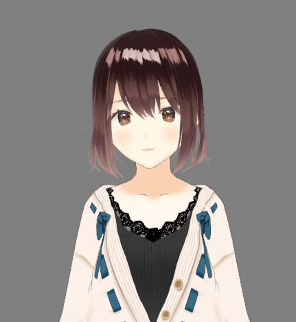
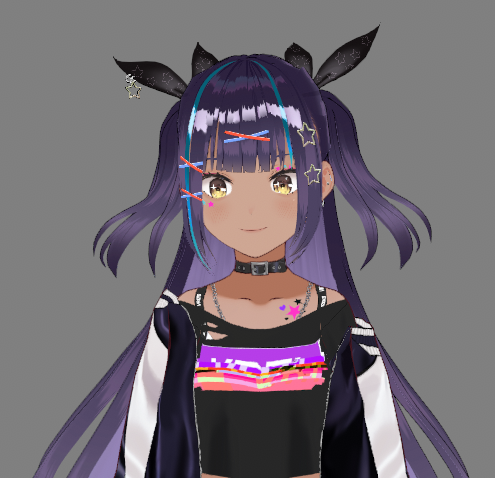
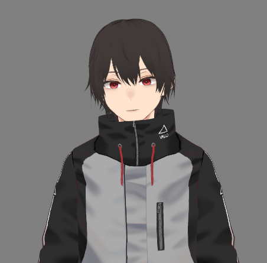

# VRM Examples

This repo contains 3 sample VRM avatars exported from VROID Studio.

The content includes the following:
| ExampleAvatar_A.vrm | ExampleAvatar_B.vrm | ExampleAvatar_C.vrm |
| :--- | :--- | :--- |
| |  | |
| [link](https://github.com/scorpionknifes/VRM-examples/blob/main/ExampleAvatar_A.vrm) | [link](https://github.com/scorpionknifes/VRM-examples/blob/main/ExampleAvatar_B.vrm) | [link](https://github.com/scorpionknifes/VRM-examples/blob/main/ExampleAvatar_C.vrm) |
